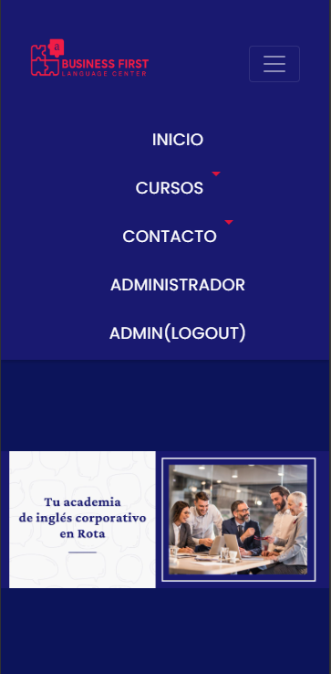
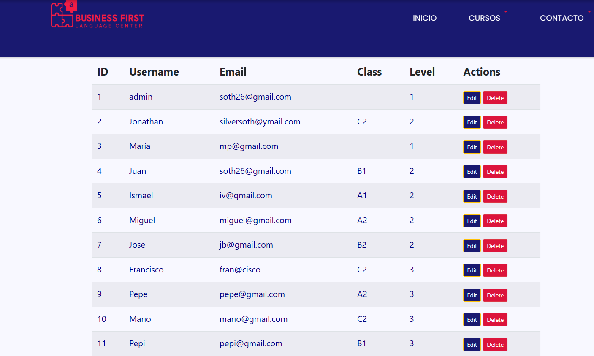
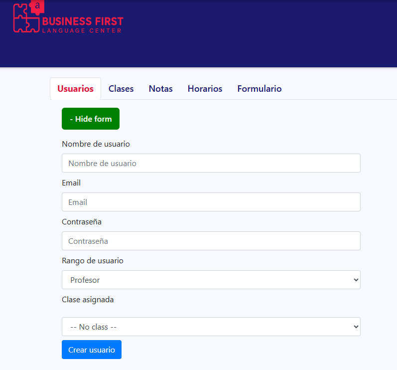
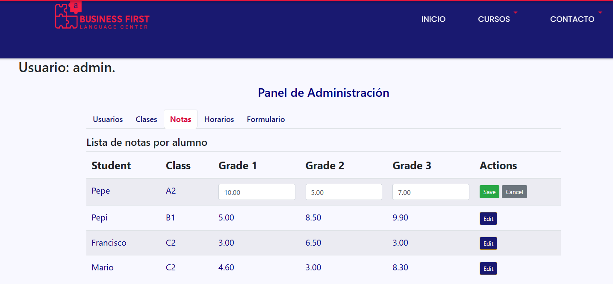
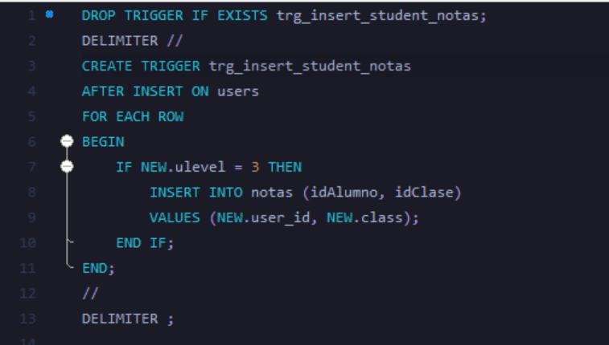
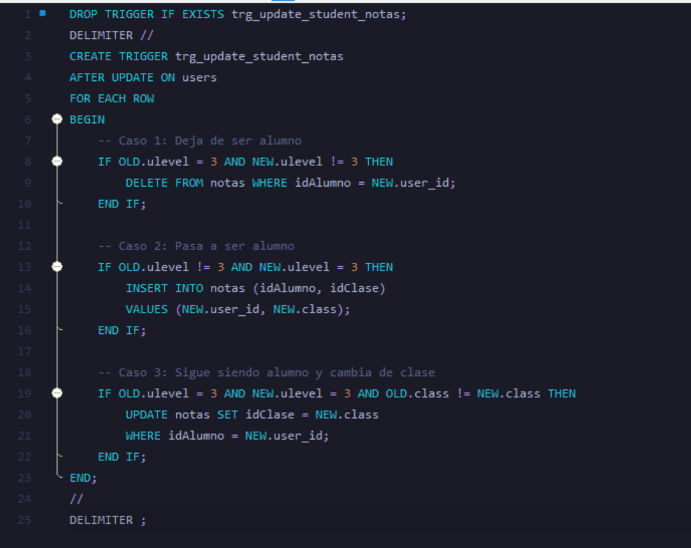
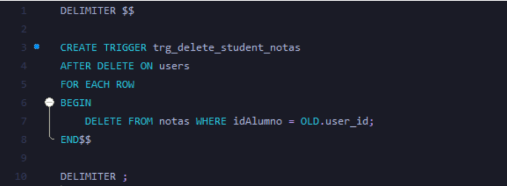
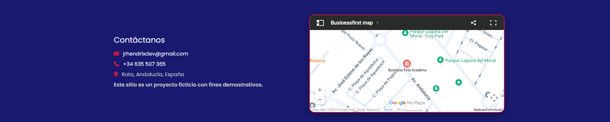

# Business First English Center

[](https://businessfirstacademy.net/)
[](https://mit-license.org/)

A complete web-based management system for an English academy focused on corporate language training.

---

## Table of Contents

- [Overview](#overview)
- [Features](#features)
- [Screenshots](#screenshots)
- [Security](#security)
- [Database & Triggers](#database--triggers)
- [Technologies Used](#technologies-used)
- [Installation](#installation)
- [Project Structure](#project-structure)
- [Project Workflow](#project-workflow)
- [Contributing](#contributing)
- [Future Improvements](#future-improvements)
- [License](#license)

---

## Overview

Business First English Center is a web-based application designed to streamline the management of an academic institution. It enables administrators to manage users, classes, grades, and schedules efficiently. The system offers dedicated views and interactions for administrators, teachers, and students.

- **Live Site:** [https://businessfirstacademy.net/](https://businessfirstacademy.net/)
- **GitHub:** [github.com/jrhendrix-dev](https://github.com/jrhendrix-dev)
- **LinkedIn:** [linkedin.com/in/jonathan-hendrix-dev](https://www.linkedin.com/in/jonathan-hendrix-dev)

---

## Features

- **Secure HTTPS:** All data transmission is encrypted, protecting user credentials and sensitive information.
- **User Authentication:** Secure login system with session management, brute-force protection, and session security best practices.
- **Role-Based Access Control:** Different interfaces and privileges for Admins, Teachers, and Students.
- **Class Management:** Create, edit, assign, and delete classes.
- **Grade Book:** Record, update, and view student grades across trimesters.
- **Schedule Management:** Assign daily class schedules dynamically.
- **Responsive Design:** Built with Bootstrap for compatibility on all devices.
- **Persistent Storage:** MySQL backend with robust data structure.
- **SQL Triggers:** Automate and enforce data integrity for student creation, updates, and deletions.
- **Brute Force Protection:** Login system includes rate limiting and lockout countdown.
- **AJAX-Powered Dashboards:** Dynamic content updates and smooth UX for all dashboards.
- **Auto-gap ID Logic:** Skips deleted IDs when creating new users/classes.
- **Automatic Foreign-Key Linking:** Student creation triggers related records.
- **Input Validation and Error Handling:** Prevents misuse or inconsistent state.
- **Centralized Bootstrap Initialization:** All PHP entry points include a `bootstrap.php` for secure session and DB setup.
- **Documented JavaScript and PHP:** All core scripts and handlers include JSDoc/PHPDoc for maintainability.

---

## Screenshots

### Responsive Layout
(https://www.loom.com/share/0d58e653abae44d38d164d00ee485bb5?sid=b8969b15-ec1a-4b51-bd62-b49f152b0dad)  
Demonstrates how the application adapts to various screen sizes.

### Admin User List
  
Administrative interface for managing users, including search and filtering.

### Admin Form Controls
(https://www.loom.com/share/61802637c1cc4f5e8dca8f4c3a94f872?sid=7445760b-7e7f-4ed1-8707-ffd90a6effae)  
Field-level controls and validation logic for user and class data.

### Grade Editing Panel
  
Interface for administrators to view, assign, or update student grades.

### Trigger: Create Student
  
Internal trigger logic for new student records.

### Trigger: Update Student
  
Trigger and interface to update student data.

### Trigger: Delete Student
  
Deletion workflow with confirmation steps.

### Application Footer
  
Footer section with version info and navigation links.

---

## Security

- **HTTPS:** All pages and forms are served over HTTPS for encrypted communication.
- **Session Security:** Session cookies use `HttpOnly` and `Secure` flags; session configuration is centralized in `bootstrap.php`.
- **Brute Force Protection:** Login attempts are rate-limited with lockout countdown and visual feedback.
- **Password Hashing:** Passwords are securely hashed using PHP's `password_hash()` and verified with `password_verify()`.
- **Centralized Initialization:** All entry points include `bootstrap.php` to enforce consistent security and DB connection.

---

## Database & Triggers

- **MySQL Triggers:** Automatically manage related records when students are created, updated, or deleted, ensuring data consistency.
- **Schema:** See `/schema.sql` for table definitions and trigger logic.

---

## Technologies Used

- PHP 7+
- MySQL
- jQuery + AJAX
- Bootstrap 4
- HTML5/CSS3

---

## Installation

1. **Clone the Repository**
   ```bash
   git clone https://github.com/jrhendrix-dev/Business-First-English-Center-PHP.git
   cd Business-First-English-Center-PHP
   ```

2. **Configure the Database**
  - Import `schema.sql` into your MySQL server.
  - Update your DB credentials in `/src/models/Database.php` or the relevant config file.

3. **Run the Server (Development Only)**

   - If you're testing locally:
    ```bash
    php -S localhost:8000 -t public/
    ```

4. **Access the App**
  - Production: https://businessfirstacademy.net
  - Open your browser and go to [http://localhost:8000](http://localhost:8000).

---

## Project Structure

```
Business-First-English-Center/
├── public/                # Public routes and static files
│   ├── index.php         # Main entry
│   ├── login.php         # Login API
│   └── assets/           # CSS, JS, images
├── src/
│   ├── api/
│   │   ├── dashboard_admin.php
│   │   ├── dashboard_teacher.php
│   │   ├── dashboard_student.php
│   │   └── partials/     # Dynamic tab content
│   ├── controllers/      # Modular controllers for each domain
│   ├── models/           # DB layer and schema
│   └── views/            # Shared view fragments
├── includes/             # AJAX endpoints per user role
├── bootstrap.php         # Global init (session + DB)
├── composer.json         # Doctum dependencies (optional)
├── docs/                 # PHPDoc, markdown, and Doctum cache
└── README.md
```

---

## Project Workflow

### 1. User Access and Entry Point

- Users (Admins, Teachers, Students, or Visitors) access the application via `public/index.php`.
- Secure session management is enforced before starting the session.
- The header (`views/header.php`) provides navigation and login/logout controls based on session state.

### 2. Authentication and Role-Based Access

- **Visitors:** Browse public information and view available courses.
- **Login Modal:** Users log in via a modal form; credentials are validated against the database.
- **Role-Based Navigation:** Navigation bar changes based on user role:
  - **Admin:** Access to admin dashboard and management features.
  - **Teacher:** Access to teacher dashboard and class/grade management.
  - **Student:** Access to student dashboard and personal grades/schedule.

### 3. Feature Access and Core Functionality

- **Class Management (Admins):** Create, edit, assign, and delete classes; assign teachers and students.
- **Grade Book (Teachers):** Record, update, and view student grades.
- **Schedule Management (Admins/Teachers):** Assign and view daily class schedules.
- **Student Portal:** View assigned classes, schedules, and grades.

### 4. Data Flow and Persistence

- All data operations (CRUD) are handled by controllers in `src/controllers/`.
- Business logic and DB interactions are managed by models in `src/models/`.
- Data is stored in MySQL, with triggers enforcing integrity for student records.
- AJAX is used for dynamic updates and form submissions.
- AJAX handlers are located in `/includes/` and follow best practices with PHPDoc and input validation.

### 5. Security and Best Practices

- **HTTPS** is enforced for all data transmission.
- **Session Security:** Cookies are set as `HttpOnly` and `Secure`.
- **Brute Force Protection:** Login attempts are rate-limited and lockouts are enforced.
- **Role-Based Access Control:** Each user role has access only to permitted features and views.
- **Input Validation:** All AJAX handlers and forms validate input and handle errors gracefully.
- **Code Documentation:** All major PHP and JavaScript files include PHPDoc/JSDoc comments.

### 6. Frontend and User Experience

- **Responsive Design:** Built with Bootstrap 4 for compatibility across devices.
- **Reusable Views:** Common UI components (header, footer, modals) are included across pages.
- **Dynamic Content:** jQuery and AJAX are used for interactive elements and real-time updates.

### 7. Typical User Workflow Example

1. Visitor lands on the homepage and browses available courses.
2. User clicks "Iniciar Sesión" and logs in.
3. System authenticates and redirects user to their dashboard based on role.
4. Admin manages classes, teachers, and students.
5. Teacher records grades and manages class schedules.
6. Student views their grades and class schedule.
7. All users can log out securely, ending their session.

---

## Contributing

1. Fork the repository.
2. Create a feature branch:  
   `git checkout -b feature-name`
3. Commit your changes:  
   `git commit -m "Add feature"`
4. Push to the branch:  
   `git push origin feature-name`
5. Submit a Pull Request.

---

## Future Improvements

- Add CSV export for reports
- Enable messaging between users
- Add automated testing (PHPUnit)
- Translate UI for multilingual support
- Make user email field unique
- Allow Admin and Teachers to order lists by different columns
- Enforce User list being limited to showing 10 users in a div window with arrows to move from page to page
- Add payment option for testing
- login with social media authentication
- password change request
- forgotten password recovery
- check if email exists

---

## License

This project is licensed under the [MIT License](https://mit-license.org/).


